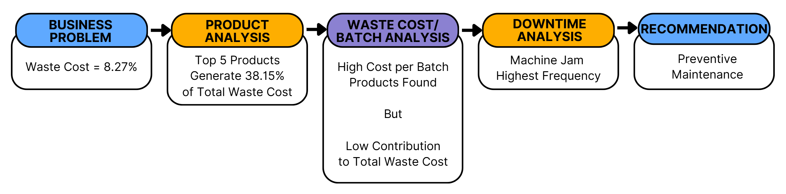
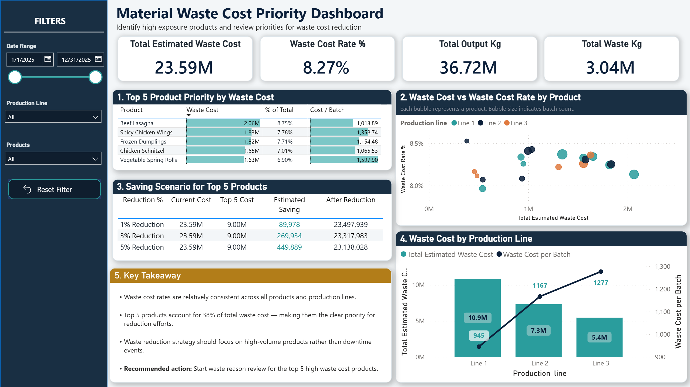
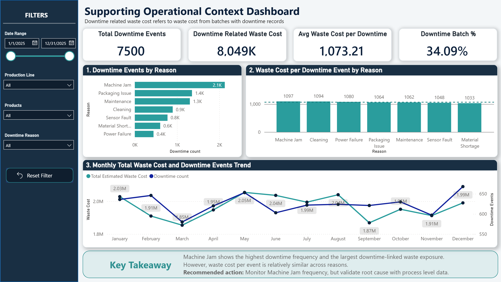
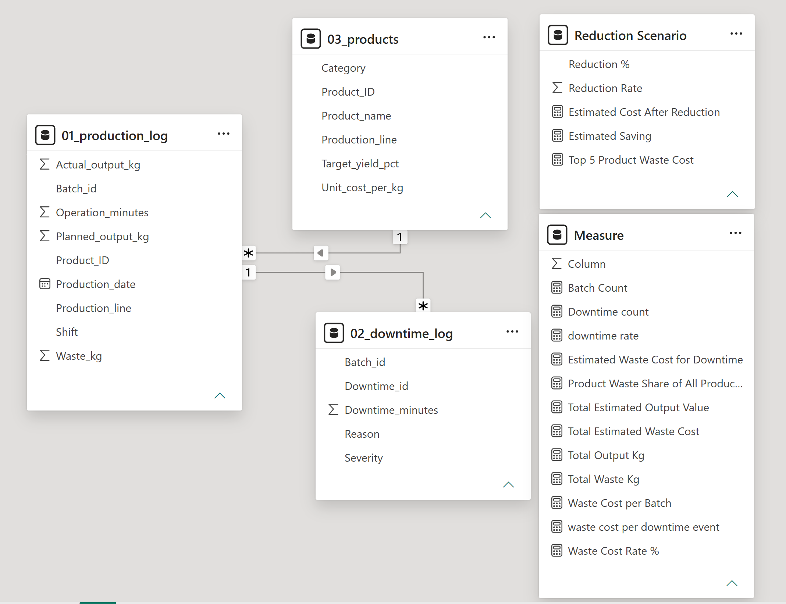

# Food Manufacturing Waste Cost Reduction Analysis

SQL | Power BI | Manufacturing Operations

---

## Executive Summary

This project investigates material waste cost in a food manufacturing operation using SQL and Power BI.

Annual waste cost represented **8.27% of total production value**, so the goal was to identify where the business should focus waste reduction efforts.

The analysis tested whether waste cost was mainly driven by product, production line, downtime, or downtime reason. 

Most factors did not show a strong waste rate difference. Instead, the strongest business opportunity came from **high volume products** and **frequent Machine Jam events**.

Key findings:

| KPI | Result |
|---|---:|
| Annual Waste Cost Rate | **8.27%** |
| Top 5 Product Waste Share | **38.15%** |
| Highest Downtime Reason | **Machine Jam** |
| Downtime Related Waste Cost | **$8.05M** |
| Potential Saving from 5% Reduction | **$449,889** |

Recommended action:

> Focus waste reduction review on the Top 5 highest waste cost products and reduce Machine Jam frequency through stronger preventive maintenance review.

---

## Investigation Journey

---
## Business Problem

Annual waste cost accounted for approximately **8.27% of total production value**.

Management wanted to understand:

- Which products create the highest waste exposure?
- Which production lines should be prioritised?
- Does downtime significantly increase waste cost?
- Which operational factors offer the greatest opportunity for waste reduction?

The objective was not simply to report historical performance, but to identify practical actions that could reduce waste cost.

---
## Dashboard Preview

<table>
  <tr>
    <td width="50%" align="center">
      <strong>Waste Cost Priority Dashboard</strong>
        
      
    </td>
    <td width="50%" align="center">
      <strong>Supporting Operational Context Dashboard</strong>
        
      
    </td>
  </tr>
</table>

## Data Model

  

### Data Structure

| Table | Purpose |
|---|---|
| `01_production_log` | Production output, waste quantity, shift, line and batch level manufacturing information |
| `02_downtime_log` | Downtime events linked to production batches |
| `03_products` | Product attributes and unit cost information |
| `Reduction Scenario` | Scenario table for 1%, 3% and 5% reduction simulations |
| `Measure` | DAX measures used for Power BI dashboard calculations |

---

## Methodology

### 1. Data Cleaning

The raw manufacturing datasets were cleaned and validated before analysis.

Checks included:

- Duplicate records
- Missing production lines
- Invalid batch records
- Downtime reason standardisation
- Product name consistency validation
- Date quality verification

---

### 2. Product Analysis

**Questions investigated:**

- Which products generate the highest waste cost?
- Which products have the highest waste cost per batch?
- How concentrated is waste cost across products?

**Result:**

The Top 5 products accounted for **38.15% of total waste cost**.

---

### 3. Production Line Analysis

**Questions investigated:**

- Which production line generates the most waste?
- Do waste rates vary significantly between lines?

**Result:**

Waste cost rates remained relatively consistent across production lines.

---

### 4. Downtime Impact Analysis

**Questions investigated:**

- Do downtime batches generate significantly more waste?
- Does downtime severity increase waste exposure?

**Result:**

No strong relationship was identified between downtime status and higher waste cost rate.

---

### 5. Downtime Reason Analysis

**Questions investigated:**

- Which downtime reasons occur most frequently?
- Which downtime reasons generate the highest waste exposure?

**Result:**

Machine Jam generated the highest downtime related waste exposure.

However, waste cost per downtime event remained relatively similar across all downtime reasons.

The primary driver was frequency rather than severity.

---

## Skills

### SQL

- Data cleaning
- CTEs
- Aggregate functions
- CASE statements
- Joins
- Business KPI calculations
- Scenario analysis

### Power BI

- Data modelling
- DAX measures
- What if scenario table
- Interactive dashboard design
- KPI reporting
- Scatter chart analysis
- Trend analysis

### Business Analysis

- Exploratory data analysis
- Operational performance review
- Waste cost prioritisation
- Scenario modelling
- Business recommendation development

---

## Results & Business Recommendations

### Finding 1

Waste cost was primarily concentrated in high volume products rather than products with unusually poor waste performance.

---

### Finding 2

The Top 5 products accounted for **38.15% of total waste cost**.

These products represent the highest financial impact area for waste reduction efforts.

---

### Finding 3

Products with above average waste cost per batch contributed only a small proportion of total waste cost.

Targeting these products alone would provide limited business value.

---

### Finding 4

Machine Jam created the largest downtime related waste exposure.

This was driven by frequency rather than higher waste cost per occurrence.

---

## Business Recommendation

### Priority 1

Focus waste reduction initiatives on the Top 5 highest waste cost products.

### Priority 2

Reduce Machine Jam frequency through:

- Preventive maintenance scheduling
- Equipment inspection reviews
- Monitoring repeat failure locations
- Tracking recurring machine issues

### Priority 3

Avoid prioritising products solely based on waste cost per batch.

Business impact should remain the primary decision criterion.

---

## Business Impact Scenario

| Reduction Scenario | Estimated Saving |
|---|---:|
| 1% Reduction | **$89,978** |
| 3% Reduction | **$269,934** |
| 5% Reduction | **$449,889** |

Small percentage improvements in high volume products can create more meaningful savings than focusing only on products with slightly higher waste cost per batch.

---

## Next Steps

The current dataset identifies where waste cost is concentrated, but it cannot fully explain why waste occurs.

Future analysis should incorporate:

- Machine level performance data
- Operator level production records
- Preventive maintenance history
- Changeover activities
- Product defect classifications
- Equipment utilisation metrics

These additional datasets would support deeper root cause analysis and more targeted waste reduction initiatives.
